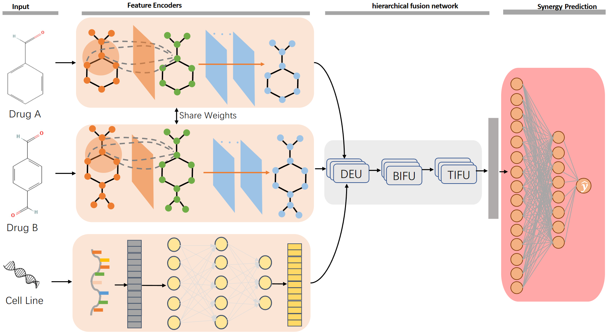
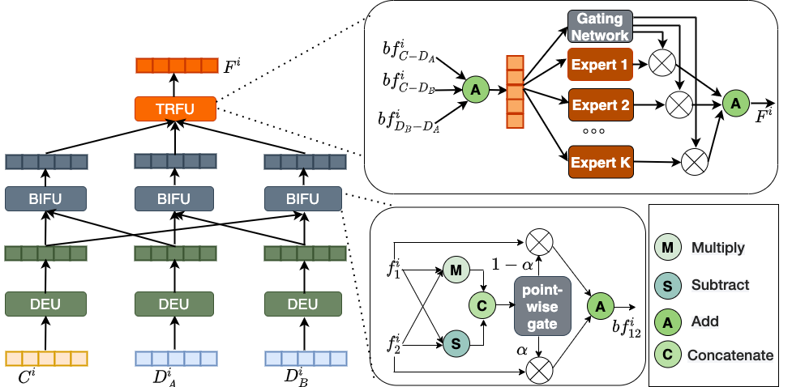

# DHFDS: deep hierarchical fusion network for drug combinations synergistic prediction

## Introduction

This repository contains the source code and dataset for paper: "DHFDS: deep hierarchical fusion network for drug combinations synergistic prediction".

## Overview

## Requirements

dgl==1.0.1+cu113\
dgllife==0.3.2\
numpy==1.23.5\
pandas==1.5.3\
prettytable==3.9.0\
scikit_learn==1.2.2\
torch==1.12.1\
tqdm==4.65.0

## Usage

- Run `python main.py` to train and test the model.
- Change `dataset_name` (`'drugcomb'` or `'drugcombdb'`) in `main.py` to use different datasets.
- Change `split_scheme` in `main.py` to use different split schemes of dataset:
    - `'random'`: Randomly partition the samples into training and test sets;
    - `'cold_drug'`: A drug in the training set does not appear in the test set;
    - `'cold_cell'`: A test cell line is never seen in the training data;
    - `'cold_drugs'`: Test drug pairs are never seen in the training set;
    - `'both_cold'`: Both the drugs and cell lines in the test data are never seen during training.